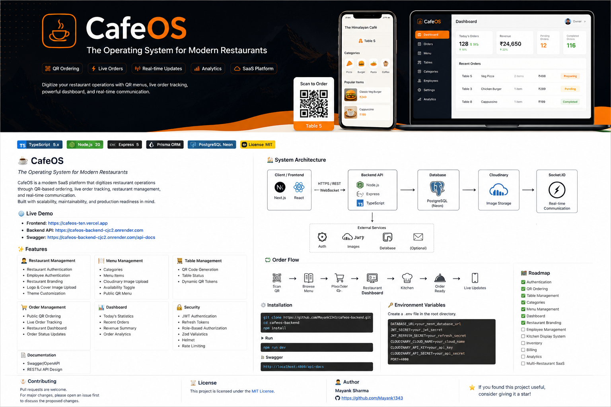

<p align="center">
  
</p>

<h1 align="center">☕ CafeOS</h1>

<p align="center">
  <b>The Operating System for Modern Restaurants</b>
</p>

<p align="center">
  A modern SaaS platform that digitizes restaurant operations with QR ordering,
  live order tracking, restaurant management, and real-time communication.
</p>

<p align="center">


</p>

---

# 🌟 Overview

CafeOS is a production-oriented Restaurant Management SaaS platform built to simplify restaurant operations through QR-based ordering, live dashboards, employee management, and real-time communication.

Unlike traditional restaurant management software, CafeOS focuses on a seamless digital dining experience where customers can scan a QR code, browse the menu, place orders, and receive live updates—without installing any app.

The project is designed with scalability, maintainability, and clean architecture in mind, making it suitable for real-world deployments and future multi-tenant SaaS expansion.

---

# 🌐 Live Demo

### Frontend

https://cafeos-ten.vercel.app

### Backend API

https://cafeos-backend-cjc2.onrender.com

### Swagger Documentation

https://cafeos-backend-cjc2.onrender.com/api-docs

---

# ✨ Features

## 👨‍💼 Restaurant Management

- Restaurant Authentication
- Employee Authentication
- Restaurant Branding
- Logo Upload
- Cover Image Upload
- Theme Customization
- Social Links
- Restaurant Profile

---

## 🍽 Menu Management

- Categories
- Menu CRUD
- Cloudinary Image Upload
- Image Replacement
- Availability Toggle
- Public QR Menu

---

## 🪑 Table Management

- QR Code Generation
- Dynamic QR Tokens
- Table Status Management
- Public Menu Access

---

## 🛒 Order Management

- QR Ordering
- Customer Order Tracking
- Live Restaurant Dashboard
- Real-time Status Updates
- Order Lifecycle

---

## 📊 Dashboard

- Today's Orders
- Revenue Summary
- Pending Orders
- Completed Orders
- Recent Orders

---

## 🔐 Security

- JWT Authentication
- Refresh Tokens
- Role-Based Authorization
- Helmet
- Rate Limiting
- Zod Validation
- Secure Password Hashing

---

## 📄 Documentation

- Swagger / OpenAPI
- RESTful API Design
- Typed Request Validation

---

# 🏗 Tech Stack

## Backend

- Node.js
- Express.js
- TypeScript
- Prisma ORM
- PostgreSQL (Neon)
- Socket.IO
- Cloudinary
- Swagger
- Zod
- Pino Logger

---

## Frontend

- Next.js
- React
- TypeScript
- TailwindCSS
- React Query
- Zustand
- Axios

---

# 🏛 System Architecture

```text
                        ┌─────────────────────────────┐
                        │      Client / Frontend      │
                        │                             │
                        │  Next.js + React + TS       │
                        └──────────────┬──────────────┘
                                       │
                        HTTPS / REST + WebSocket
                                       │
                                       ▼
                    ┌─────────────────────────────────┐
                    │         Express Backend          │
                    │                                 │
                    │  Controllers                    │
                    │  Services                       │
                    │  Middleware                     │
                    │  Validation                     │
                    └───────┬───────────────┬─────────┘
                            │               │
                            │               │
                            ▼               ▼
               PostgreSQL (Neon)      Cloudinary
                  Prisma ORM        Image Storage
                            │
                            ▼
                       Socket.IO
                  Real-time Updates
```

---

# 🔄 Customer Order Flow

```text
Customer
     │
     ▼
Scan QR Code
     │
     ▼
Browse Menu
     │
     ▼
Add Items
     │
     ▼
Place Order
     │
     ▼
Restaurant Dashboard
     │
     ▼
Kitchen Preparation
     │
     ▼
Order Ready
     │
     ▼
Customer Receives Live Updates
```

---

# 📦 API Modules

- Authentication
- Public
- Tables
- Categories
- Menu
- Orders
- Dashboard
- Settings

---

# 📂 Project Structure

```text
src
├── config
├── controllers
├── docs
├── lib
├── middleware
├── routes
├── services
├── utils
├── validations
├── app.ts
└── server.ts
```

---

# 📸 Screenshots

> Replace these placeholders with screenshots as the project evolves.

- Login Page
- Dashboard
- Table Management
- Menu Management
- Restaurant Settings
- Public QR Menu
- Live Order Tracking
- Swagger Documentation

---

# 🚀 Getting Started

## Clone Repository

```bash
git clone https://github.com/Mayank1343/cafeos-backend.git

cd cafeos-backend
```

---

## Install Dependencies

```bash
npm install
```

---

## Environment Variables

Create a `.env` file.

```env
DATABASE_URL=

JWT_SECRET=
JWT_REFRESH_SECRET=

CLOUDINARY_CLOUD_NAME=
CLOUDINARY_API_KEY=
CLOUDINARY_API_SECRET=

PORT=4000
```

---

## Generate Prisma Client

```bash
npx prisma generate
```

---

## Run Database Migrations

```bash
npx prisma migrate dev
```

---

## Start Development Server

```bash
npm run dev
```

---

# 📖 API Documentation

Swagger is available at

```
http://localhost:4000/api-docs
```

---

# 🛣 Roadmap

## ✅ Completed

- Authentication
- Refresh Tokens
- QR Ordering
- Table Management
- Categories
- Menu Management
- Image Uploads
- Cloudinary Integration
- Dashboard APIs
- Restaurant Branding
- Swagger Documentation
- Public Menu

---

## 🚧 In Progress

- Employee Management (RBAC)

---

## 🔜 Planned

- Kitchen Display System (KDS)
- Inventory Management
- Discounts & Coupons
- Billing & Invoicing
- Analytics & Reports
- Notifications
- Multi-Restaurant SaaS
- Subscription & Billing
- Payment Gateway Integration
- Audit Logs

---

# 🎯 Design Principles

CafeOS follows a layered architecture to keep the codebase scalable and maintainable.

- Thin Controllers
- Business Logic in Services
- Prisma Access only inside Services
- Zod Request Validation
- RESTful APIs
- Modular Folder Structure
- Stateless JWT Authentication
- Production-ready Logging

---

# 🤝 Contributing

Contributions are welcome.

If you would like to contribute:

1. Fork the repository.
2. Create a feature branch.
3. Commit your changes.
4. Open a Pull Request.

For major changes, please open an issue first to discuss your proposal.

---

# 📜 License

This project is proprietary software. The source code is publicly available for portfolio and evaluation purposes only. All rights are reserved by the author.

---

# 👨‍💻 Author

**Mayank Sharma**

- GitHub: https://github.com/Mayank1343

---

# ⭐ Support

If you found this project useful, consider giving it a **Star ⭐**.

It helps others discover the project and motivates future development.
